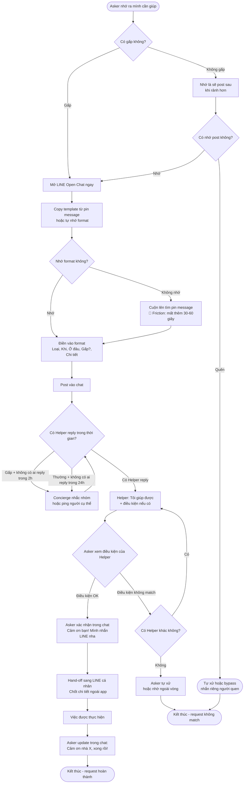
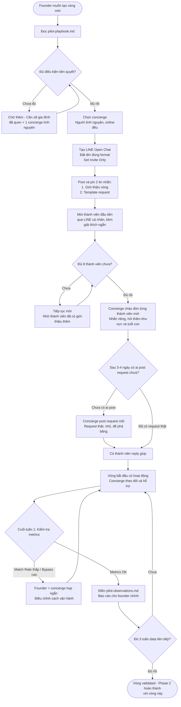
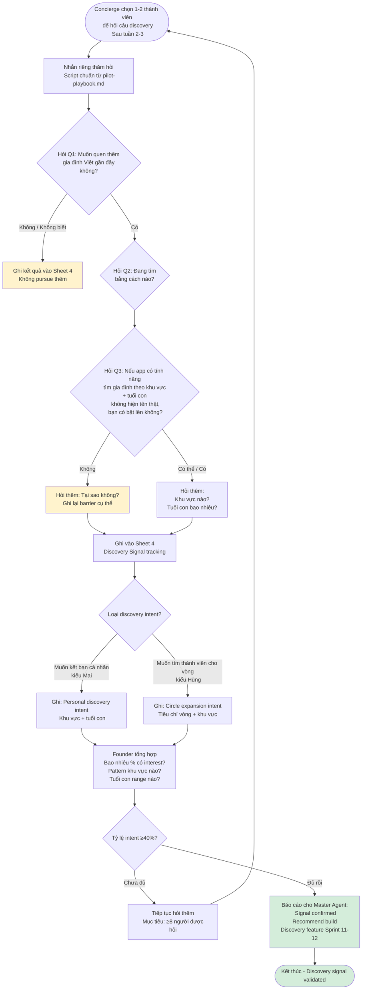

# User Flows — Vòng Tròn Tương Trợ

> 3 user journeys chính mô tả cách người dùng tương tác với hệ thống hiện tại (LINE Open Chat, manual flow — chưa có app).
> Các friction points được đánh dấu rõ để inform thiết kế app sau này.

Xem thêm: [user-personas-v2.md](./user-personas-v2.md) | [use-cases.md](./use-cases.md) | [user-stories-v2.md](./user-stories-v2.md) | [glossary.md](../00-foundation/glossary.md)

---

## Journey 1 — Post Aid Request

**Persona chính:** Linh (bà mẹ chủ động)
**Mô tả:** Asker nhận ra mình cần giúp đỡ, post request vào LINE Open Chat, Helper thấy và respond, hai bên kết nối qua LINE.

### Flowchart

### Happy Path

1. Asker nhận ra cần giúp (ví dụ: 4:30pm biết sẽ bị kẹt không đón con được)
2. Mở LINE Open Chat của vòng
3. Copy format từ pin message hoặc tự nhớ, điền nhanh
4. Post vào chat, đánh dấu "Gấp" nếu cần
5. Trong 30 phút (gấp) hoặc vài tiếng (thường): Helper reply "Tôi giúp được"
6. Asker xác nhận, nhắn LINE riêng để chốt chi tiết
7. Việc được thực hiện, Asker update kết quả trong chat

### Edge Cases

| Tình huống | Xử lý |
|---|---|
| Không ai reply sau 2h (gấp) | Concierge nhắc nhóm, có thể ping thẳng 1-2 người biết có thể giúp |
| Không ai reply sau 24h (thường) | Concierge hỏi thăm Asker, tìm phương án khác |
| Helper đặt điều kiện không match | Asker tìm Helper khác hoặc tự xử |
| Helper cancel last minute | Asker post lại request (xem UC-006 trong use-cases.md) |
| Request được post ngoài giờ active (sau 10pm) | Không có match cho đến sáng hôm sau |

### Friction Points hiện tại (chưa có app)

- **F1 — Tìm format:** Phải cuộn lên tìm pin message nếu không nhớ template → mất thêm thời gian
- **F2 — Không biết ai rảnh:** Không có thông tin về availability của thành viên → post và đợi
- **F3 — Notification lẫn lộn:** Request chìm trong hàng trăm tin khác trên LINE → Helper hay bỏ lỡ
- **F4 — Hand-off thủ công:** Phải nhắn riêng trên LINE sau khi match — không có cơ chế tự động share LINE ID
- **F5 — Không có signal "đã resolved":** Group chat không có trạng thái request, phải đọc thread để biết

---

## Journey 2 — Join New Circle (Founder Setup)

**Persona chính:** Hùng (người kết nối) — làm founder cho vòng mới
**Mô tả:** Founder mới được giới thiệu playbook, setup LINE Open Chat, invite thành viên, pin template, vòng bắt đầu vận hành.

### Flowchart

### Happy Path

1. Founder đọc [pilot-playbook.md](./pilot-playbook.md), xác nhận đủ điều kiện
2. Chọn concierge tình nguyện — người online đều, không ngại nhắn tin
3. Tạo LINE Open Chat, setup đúng format (tên, mô tả, invite-only)
4. Pin 2 tin nhắn: giới thiệu vòng + template request
5. Mời từng thành viên qua LINE cá nhân, giải thích ngắn mục đích vòng
6. Concierge chào đón từng người mới trong 48h đầu
7. Sau 3-4 ngày: có request đầu tiên (thật hoặc mồi), được match thành công
8. Tuần 1 kết thúc: điền observations, báo cáo founder chính

### Edge Cases

| Tình huống | Xử lý |
|---|---|
| Thành viên được mời không join | Không nhắc quá 1 lần — tôn trọng thể diện |
| Thành viên join nhưng không hiểu format | Concierge nhắn riêng hướng dẫn, không nhắc công khai |
| Không tìm được concierge | Founder tự làm concierge thêm 1-2 tuần, hoặc chờ |
| Vòng có < 8 thành viên sau 2 tuần | Thảo luận với founder chính — có thể mở rộng tiêu chí |
| Request đầu tiên không được match | Concierge can thiệp, tìm người giúp thủ công lần đầu |

### Friction Points hiện tại (chưa có app)

- **F1 — Onboard manual:** Không có link signup chuẩn, phải giải thích từng người qua LINE
- **F2 — Không biết ai đã đọc pin message:** Không có cách biết thành viên đã xem format chưa
- **F3 — Tracking thủ công:** Metrics phải ghi tay vào Google Sheets
- **F4 — Không có chuẩn playbook trước Phase 1:** Giờ đã có [pilot-playbook.md](./pilot-playbook.md), friction giảm đáng kể
- **F5 — Concierge không có tool:** Phải nhớ trong đầu ai cần được follow up

---

## Journey 3 — Discovery Intent

**Persona chính:** Mai (gia đình mới đến — discovery intent) và Hùng (người kết nối — muốn mở rộng vòng)
**Mô tả:** Thành viên được hỏi về discovery intent, express interest, được hỏi thêm thông tin khu vực và tuổi con, founder ghi lại để phục vụ quyết định xây feature.

### Flowchart

### Happy Path

1. Concierge chọn thành viên đã active ≥2 tuần để hỏi
2. Nhắn riêng thăm hỏi tự nhiên, sau đó đi vào câu discovery
3. Thành viên express interest (Q1: Có)
4. Hỏi thêm Q2 (đang tìm thế nào) và Q3 (sẽ bật feature không)
5. Thành viên confirm Q3: Có (hoặc Có thể)
6. Hỏi thêm về khu vực và tuổi con muốn tìm
7. Ghi vào Sheet 4 với phân loại intent (personal / circle expansion)
8. Sau khi đủ ≥8 người được hỏi: tổng hợp signal, báo cáo

### Edge Cases

| Tình huống | Xử lý |
|---|---|
| Thành viên không muốn trả lời | Không ép — ghi "không có data" |
| Thành viên muốn kết bạn nhưng lo privacy | Ghi barrier cụ thể, đây là input quan trọng cho design |
| Thành viên muốn nhưng không rõ khu vực | Ghi "interested, khu vực chưa xác định" |
| Signal thấp (< 40% Có) sau ≥8 người | Báo founder — có thể không cần build Discovery |
| Signal cao nhưng barrier privacy cao | Vẫn build, nhưng ưu tiên privacy features trước |

### Friction Points hiện tại (chưa có app)

- **F1 — Manual interview:** Phải nhắn riêng từng người, không thể scale
- **F2 — Không có form chuẩn:** Mỗi cuộc trò chuyện có thể đi theo hướng khác nhau
- **F3 — Data phân tán:** Ghi vào Sheet 4 nhưng không có cách visualize pattern nhanh
- **F4 — Hand-off chưa rõ:** Nếu 2 người muốn quen nhau — hiện chưa có cơ chế introduce (founder phải làm thủ công)
- **F5 — Expire không có hệ thống:** Nếu người muốn discovery và không có ai phù hợp ngay — không có cách track và notify sau này khi có người phù hợp

---

## Tóm tắt Friction Points cho thiết kế App

Tổng hợp các friction points từ 3 journeys — đây là input chính cho design phase:

| # | Friction | Journey | Severity | Giải pháp dự kiến trong app |
|---|---|---|---|---|
| F1 | Tìm format phải cuộn lên | J1 | Cao | Form có sẵn, không cần cuộn |
| F2 | Không biết ai rảnh | J1 | Cao | Availability indicator (nếu opt-in) |
| F3 | Notification lẫn lộn | J1 | Cao | Smart notification, dedicated channel |
| F4 | Hand-off thủ công sau match | J1 | Trung bình | Tự động share LINE contact sau match |
| F5 | Không có request status | J1 | Trung bình | Request lifecycle tracking |
| F6 | Onboard manual không có link chuẩn | J2 | Cao | Invite link + guided onboard |
| F7 | Tracking thủ công (Google Sheets) | J2 | Trung bình | Dashboard metrics trong app |
| F8 | Concierge không có tool | J2 | Thấp | Notification khi request chưa được match |
| F9 | Discovery phải interview manual | J3 | Cao | In-app discovery opt-in flow |
| F10 | Discovery data phân tán | J3 | Thấp | Discovery analytics cho founder |

---

*Nguồn: Phase 1 pilot observations | `user-personas-v2.md` | `use-cases.md` | `pilot-playbook.md`*
*Tạo: 2026-05-16 | Cập nhật khi có thêm data từ Phase 2*
